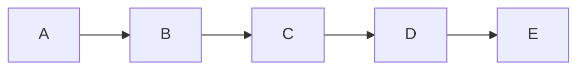

# 欢迎

欢迎来到此博客

本博客使用了自己写的[simplog](https://github.com/cueavy/simplog)博客框架

目前还比较简陋,该有的功能都还没写~~(主要是既懒又没时间)~~

# 文章

*简单用js写了个动态生成的目录*

<div id = "posts" ></div>

<script>
    fetch( "/api/post.json" )
        .then( ( response ) => response.json() )
        .then( ( data ) => {
            var div = document.getElementById( "posts" );
            for ( var i = 0 ; i < data.length ; i++ ){
                div.insertAdjacentHTML( "beforeend" , `<p><a href="/post/${ data[ i ][ "id" ] }">${ data[ i ][ "title" ] }</a> 简介: ${ data[ i ][ "description" ] } 标签: [${ data[ i ][ "tags" ] }] 日期: ${ new Date( data[ i ]["time"] * 1000 ).toLocaleString() }</p>` );
            }
        } );
</script>

# 测试

- LaTeX(MathJax)
- 静态代码高亮(pygments)
- mermaid

$$
2KMnO_4\xlongequal{\Delta}K_2MnO_4+MnO_2+O_2\uparrow
$$

```python
import re

def formatname( name : str ) -> str :
    name = name.strip()
    if name and name[ 0 ] == "." : name = name[ 1 : ]
    if name and name[ -1 ] == "." : name = name[ : -1 ]
    name = name.replace( " " , "-" )
    name = re.sub( """[<>:"/\\|?*]""" , "_" ,  name )
    return name[ : 255 ]
```



