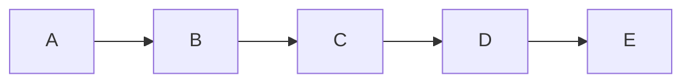

# 测试页面

# [返回](/)

# 关于

此**页面**是~~用来~~^^测试^^功能[^1]的

[^1]: 脚注测试


---

# H1
## H2
### H3
#### H4
##### H5
###### H6

> 1
> 2
> 3
> > 4
> > 5
> 6

LaTeX:

$$
2KMnO_4\xlongequal{\Delta}K_2MnO_4+MnO_2+O_2\uparrow
$$

$$
Zn+H_2SO_4=ZnSO_4+H_2\uparrow
$$

```python
"""
renderer
"""
import argparse
import langful
import typing

class ArgumentParser( argparse.ArgumentParser ) :

    def __init__( self , prog : str , description : str , help : str , lang : langful.lang , **kwargs : typing.Any ) -> None :
        super().__init__( lang.get( prog ) , description = lang.get( description ) , add_help = False , **kwargs )
        self.add_argument( "-h" , "--help" , action = "help" , help = lang.get( help ) )
        self.lang = lang
```


