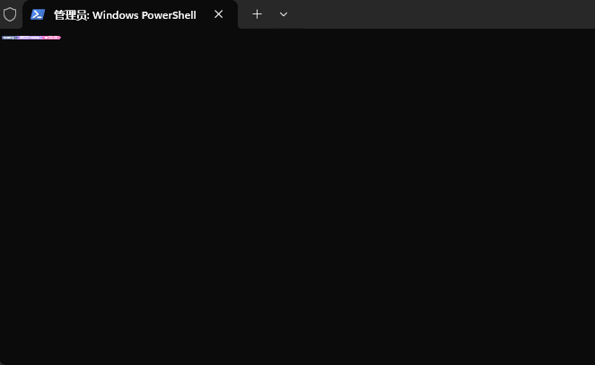

# 说明

这是以前写的几段代码,仅仅是实现了功能,但是性能可能不高

代码片段可以在[这里](https://gist.github.com/cueavyqwp/4afa166f8b42f6e8c01b29aad2f2a776)找到

依赖库为`opencv-python`

# 演示

## 生成

> 转换时视频分辨率会被缩小,这个缩小到多大可以看需要修改源代码

彩色视频

```bash
python color.py "[视频路径]"
```

黑白视频

```bash
python main.py "[视频路径]"
```

然后等待视频转换

此时会在程序所在目录生成一个`output`文件夹

目录结构类似这样

- output
- - data
- - - frame-xxx
- - info.json

`info.json`文件类似这样

```json
{
    "tpf": 0.03,
    "data": [
        "data\\frame-xxx"
    ]
}
```

`tpf`即`time per frame`(每帧时间)
`data`列表里代表每一帧的路径

> 话说可以改成显示总帧数然后就可以移除`data`里那么多无用内容了 算了懒得改了(´ｰ∀ｰ`)

## 播放

```bash
python show.py "[输出文件夹路径]"
```

调小字号 接着就可以播放视频了



# 原理

原理其实很简单

## 生成原理

首先使用opencv读取视频信息

$$
每帧时间=\frac{1}{视频帧率}
$$

接着逐帧读取内容,压缩画面大小

接着对每个像素进行处理

黑白版是转化为黑白画面接着根据颜色明暗选择字符

彩色版是使用`█`字符搭配上ANSI转义码`\x1b[38;2;[蓝色(B)];[绿色(G)];[红色(R)]m`

保存字符到对应帧的文件里即可

## 播放原理

循环读取帧

记录开始时间

输出`\033[0;0H`清屏,接着输出对应帧文件里的内容

当 结束时间 - 开始时间 小于 每帧时间 时sleep等待即可

# 总结

生成的文件在缩小的情况下还是比原始视频还大,毕竟没有压缩

播放较大分辨率视频时会很卡

但总的来说还是能用的~~(能跑就行)~~
